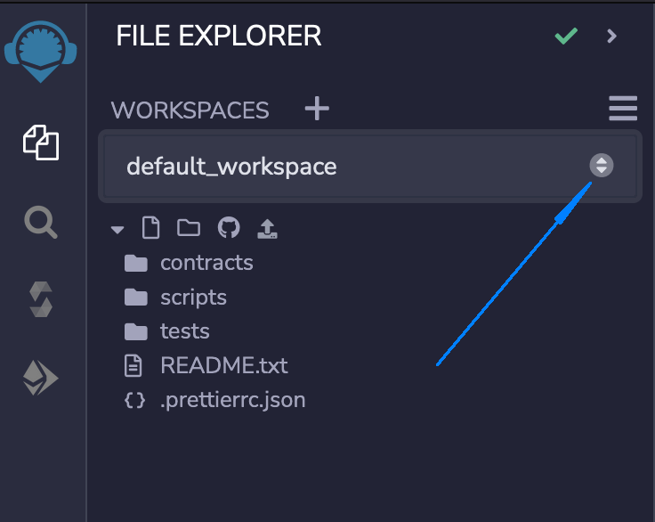
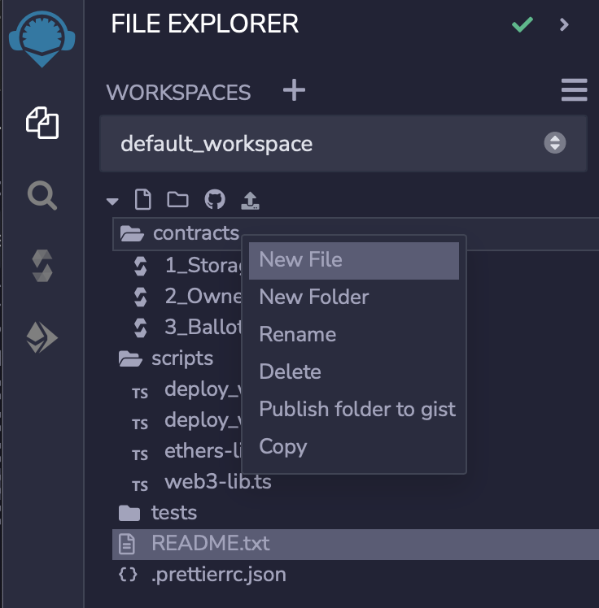
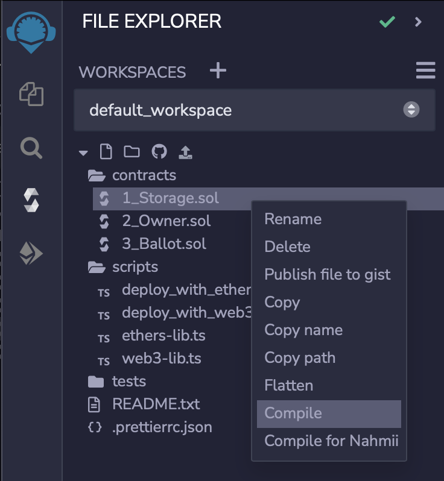
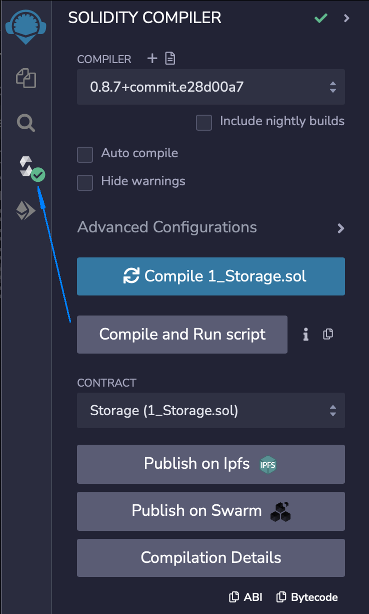
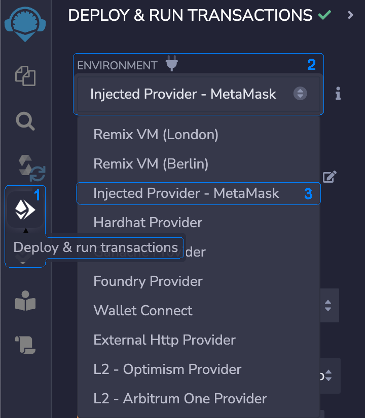
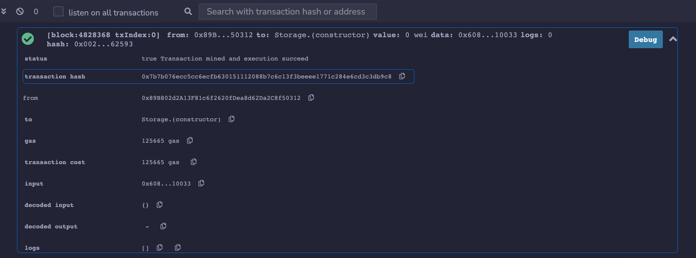
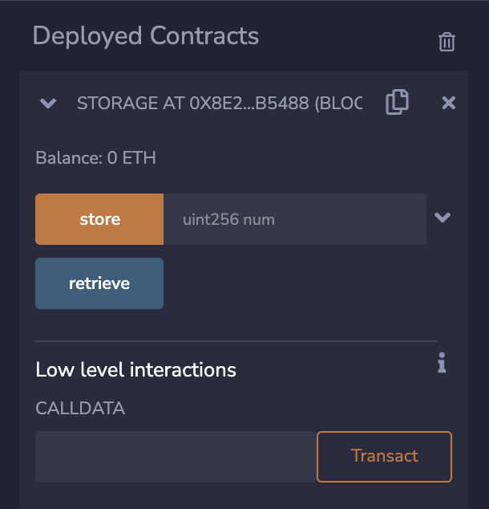
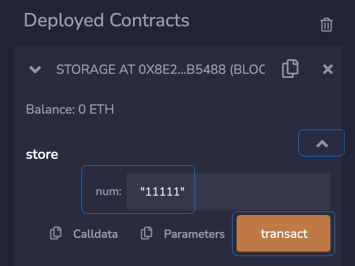
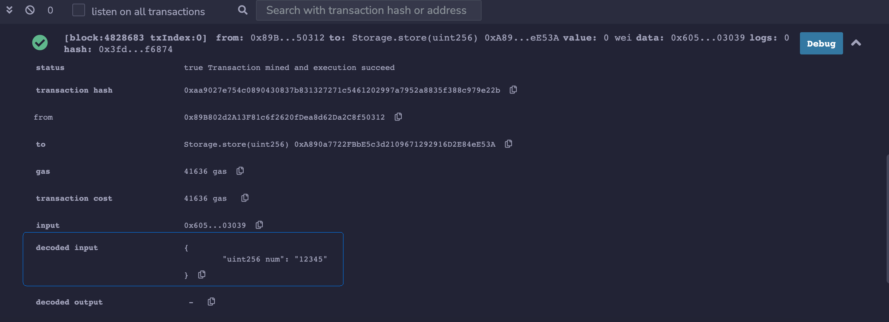

## Remix IDE

Remix IDE is a popular integrated development environment, which can be used throughout the whole process of smart contract development. It is intuitive thus very easy to use. Remix can be used by any developer with any level of experience. This document outlines the main steps you have to go through to develop a smart contract for the Trust network, written with Solidity programming language. The document does not go into the full details, for that please consult the official Remix documentation which can be found at [remix-ide.readthedocs.io](https://remix-ide.readthedocs.io/en/latest/). However, the main steps and the important settings needed to connect to Trust network are presented below.

The Remix IDE comes in 3 flavors, the web application, the desktop application, and as a VSCode extension. This tutorial uses the Remix web app IDE. From here onwards the `Remix IDE` refers to the Remix web application integrated development environment.

## Start A Workspace

Navigate to the [Remix IDE web version](https://remix.ethereum.org/). One of the first thing you notice is the file explorer panel on the left side of the screen. You can see that the Remix IDE already created a default workspace with three folders `Contracts`, `Scripts` and `Tests` and a `README.txt` file.
\

You can read the `README.txt` file for details about what each folder purpose is.

## Write A Smart Contract

Now you can create a new solidity file where to write the smart contract. Conventionally a solidity file has the `.sol` extension. Right-click on the `contracts` folder and select `New File` menu option, chose a name for your file, and then write the solidity code, which defines the smart contract, in the newly created file. As an alternative you can use one of the samples solidity files provided by the Remix IDE.

\

For simplicity this tutorial uses the existing `1_Storage.sol` sample smart contract.

## Compile The Smart Contract

To compile the `Storage` sample smart contract, right click on the `1_Storage.sol` file and chose `Compile` menu option.

\

The compilation for this smart contract is instant and if successful you can notice a green mark on the solidity compiler switch button on the right side of screen. Click on that button to navigate the Remix IDE `Solidity Compiler` panel.

\

 If the compilation fails you can notice a red icon instead of the green one and if you click on it you can find details about the compilation errors on the `Solidity Compiler` panel.

 You will return to this panel later, after you deployed the smart contract, and when you will want to [verify](#verify-the-smart-contract) the deployed smart contract.

## Connect To Trust

### Connect Metamask Wallet

To connect the Remix IDE to the Trust network you must first [connect your metamask wallet](../about-the-testnet/connect-metamask.md) to the Trust network. You can connect ot the Trust main network or you can connect to any of the available Trust test networks. For information about available Trust networks please consult the [resources page](../about-the-testnet/resources.md).

### Have Enough EMV Tokens

You also must ensure you have EVM tokens available in your wallet to be able to cover the transactions costs. If you use the Trust test network you can use the [faucet](https://faucet.testnet-dev.trust.one) to get some EVM tokens. If you use the Trust main network you must transfer tokens from a different address or swap them from EOS tokens or any other available tokens.

### Connect the Remix IDE To Trust

To connect the Remix IDE to Trust network:

1. Click the `Deploy & run transactions` button on the left side vertical menu to swtich to `Deploy & run transactions` panel
2. Click the `ENVIRONMENT` drop-down list
3. Select from the `Injected Provider - Metamask` option

\

Right after you successfully selected `Injected Provider - Metamask` option from the drop-down list the `ACCOUNT` field gets populated with your wallet address. Make note of it and make sure it is indeed the same address as your Metamask wallet.

## Deploy The Smart Contract

1. Make sure the `CONTRACT (Compiled by Remix)` field shows the value `Storage/contracts - 1_Storage.sol`. If not click on the drop-down list and select it.
2. Click Deploy button
3. Confirm the transaction on Metamask wallet
4. Wait for the transaction to complete on the blockchain

When the transaction is done you will see details in the bottom panel. Notice the status of the transaction and the transaction hash. You can open the [blockchain explorer](https://trustscan.one/) and search for the transaction hash to see it on chain.

\

## Execute Actions

As soon as the smart contract is deployed to the blockchain, that is, the transaction is confirmed on the blockchain, you can interact with the smart contract through the Remix `DEPLOY & RUN TRANSACTIONS` panel.

At the bottom of the panel you can see the `Deployed Contracts` section which lists all deployed smart contracts in this Remix session. You should see one smart contract 'STORAGE' followed by the blockchain address where the smart contract was deployed at. Click the small button at the left side of the contract name to expand the panel and see its details. At the top of the details panel you can see the balance of your smart contract address and then below the list of actions your smart contract implements. In this case you can see two actions, the `store` and the `retrieve`.

\

To send an instance of the `store` action to your smart contract you first set the value for its `num` parameter which is of type `uint256` and then click the `store` button. If the action has multiple params you have to expand the list of the parameters to see them all and provide values for each of them before clicking the `transact` button.

\

The click on the `store` or on the `transact` button opens up the Metamask wallet with the transaction you are about to send to the blockchain. This transaction packs the `store` action with the parameter you typed. Go ahead and click on the `Confirm` Metamask button to sign the transaction and send it to the blockchain.

Wait for the transaction to be confirmed on the blockchain and note on the Remix log panel, on the bottom of the screen, the status of the transaction, the transaction hash and the decoded input parameter value.

\

Search for the transaction hash on the [blockchain explorer](https://trustscan.one/). Note that the input parameter is not decoded. In order to see it decoded you must verify your smart contract on chain.

\

## Verify The Smart Contract

To verify the smart contract follow the steps outline in the [how to verify a smart contract](./how_to_verify_a_smart_contract.md) document.
